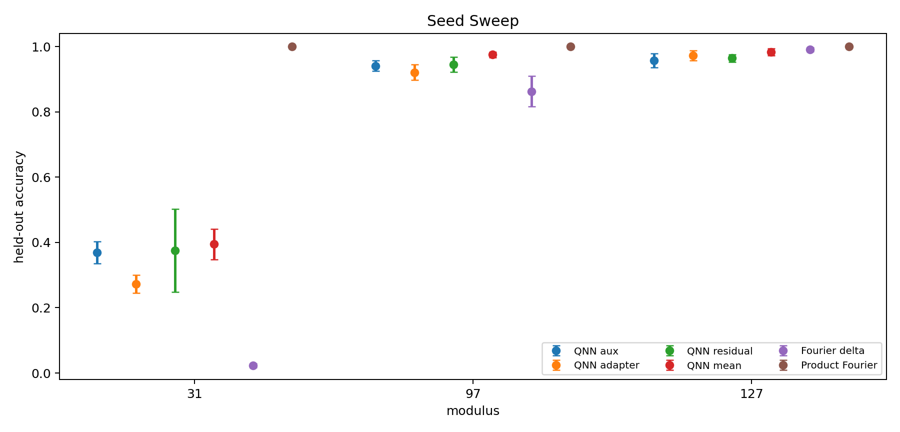
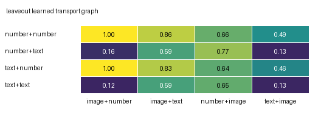

# Tri-Modal and QNN Grokking

This research release studies how neural and simulated quantum models learn
modular addition across number, text, and image representations. It combines
three related questions:

1. Does a model learn a shared cyclic rule across modalities?
2. Which route-specific states causally carry that rule?
3. Can a small statevector-simulated QNN implement a robust Fourier/Dirac
   readout, and which architectural interventions improve exact selection?

The strongest evidence supports **shared cyclic answer machinery with
route-, seed-, and modality-specific access**, not a perfectly symmetric
universal modality manifold and not a claim of quantum advantage.

## Selected Results

### 1. Tri-Modal QNN: strict cyclic readout across five seeds

The strict three-sector layerwise Dirac-mean model reached mean held-out exact
accuracy `0.923474` across seeds `9301-9305` at step 2,000. The best seed
reached `0.941543`; the worst reached `0.910112`.

At the seed-9301 checkpoint, restoring the full Fourier band recovered the
clean held-out accuracy `0.912542`. Ablating frequencies `1..13` reduced
accuracy to between `0.000000` and `0.042211` for the tested residue offsets.
Sector interventions show that the computation is text-dominant but not
text-only.

The harder ordered-route answer-query model reached `0.794497` held-out
accuracy across all nine routes. Removing cross-sector mixing reduced accuracy
to `0.010325`, approximately chance (`1/97`). This is strong causal evidence
that operand information must be routed into the answer-query sector.

Inside the archive: reports/RESULTS_TRIMODAL_QNN_CODEX.md and results/trimodal_qnn/seed_pipeline_summary.csv.

### 2. QNN: fixed layerwise averaging improves exact selection

Across model seeds `0,1,2`, the fixed layerwise Dirac mean reached mean
held-out accuracy `0.975305` at modulus 97 and `0.983438` at modulus 127. It
was the strongest tested QNN family at those moduli. The result did not
transfer uniformly to modulus 31, where mean held-out accuracy was `0.394750`.

This is an architecture/intervention result, not evidence of computational
quantum advantage. All experiments use a classical PyTorch statevector
simulator.

Selected figure inside the archive: figures/qnn/qnn_seed_modulus_sweep.png.

Inside the archive: reports/RESULTS_QNN_LAYERWISE_DIRAC.md and results/qnn/SWEEP_AGGREGATE.md.

### 3. Classical Tri-Modal: shared answer geometry, uneven route access

The primary full-crossmodal run reached held-out exact accuracy `0.999871`
over 177,849 examples and mean Fourier addition-diagonal energy `0.937730`.
Full answer-slot patching transferred the answer causally. A later image-pixel
extension reached held-out template accurcy `0.999899` and foreground IoU
`0.975426`.

The mechanistic conclusion is deliberately narrower than the behavioral
score. Strict linear-chart evidence varies by seed, and leave-out experiments
show that route access is not universally zero-shot. Learned transport maps
meaningfully repair omitted routes, including complete repair for one tested
`image+number` setting, but usually remain below full-state patching.

Selected figure inside the archive: figures/trimodal_routes/leaveout_learned_transport_route_graph.png.

Inside the archive: reports/RESULTS_TRI_MODAL_MODULAR_GROKKING.md, reports/RESULTS_TRI_MODAL_RIGOROUS_PROBES.md, and reports/RESULTS_TRI_MODAL_ROUTE_TRANSPORT_MAPS.md.

## Repository Map

```text
trimodal_qnn_codex/          Tri-Modal statevector QNN implementation
modular_addition/            QNN baselines, sweeps, and analysis scripts
tri_modal_modular_grokking/  Classical Tri-Modal model and causal analyses
configs/                     Focused QNN configurations
tests/                       Selected unit tests
reports/                     Full result narratives
results/                     Compact machine-readable evidence
figures/                     Selected reviewer-facing figures
```

Large checkpoints, raw training runs, caches, queue state, and internal handoff
notes are intentionally excluded. The included result tables are sufficient to
audit the headline values but not to reconstruct every historical run.

## Verification

The packaged code was checked on 6 August 2026:

- 32 focused Tri-Modal and Tri-Modal QNN unit tests passed.
- 14 modular-QNN checkpoint and initialization tests passed.
- both 20-step Tri-Modal QNN smoke configurations completed end to end;
- the three-step classical Tri-Modal training smoke completed end to end.

See [SMOKE_TESTS.md](SMOKE_TESTS.md) and
[REPRODUCIBILITY.md)(REPRODUCIBILITY.md).

## Scope

This is a research artifact for review. The QNN code simulates statevectors on
classical hardware. The experiments do not establish hardware speedup,
resource advantage, universal cross-modality transfer, or a general theory of
multimodal representation learning.
# Tri-Modal and QNN Grokking

This research release studies how neural and simulated quantum models learn
modular addition across number, text, and image representations. It combines
three related questions:

1. Does a model learn a shared cyclic rule across modalities?
2. Which route-specific states causally carry that rule?
3. Can a small statevector-simulated QNN implement a robust Fourier/Dirac
   readout, and which architectural interventions improve exact selection?

The strongest evidence supports **shared cyclic answer machinery with
route-, seed-, and modality-specific access**, not a perfectly symmetric
universal modality manifold and not a claim of quantum advantage.

## Selected Results

### 1. Tri-Modal QNN: strict cyclic readout across five seeds

The strict three-sector layerwise Dirac-mean model reached mean held-out exact
accuracy `0.923474` across seeds `9301-9305` at step 2,000. The best seed
reached `0.941543`; the worst reached `0.910112`.

At the seed-9301 checkpoint, restoring the full Fourier band recovered the
clean held-out accuracy `0.912542`. Ablating frequencies `1..13` reduced
accuracy to between `0.000000` and `0.042211` for the tested residue offsets.
Sector interventions show that the computation is text-dominant but not
text-only.

The harder ordered-route answer-query model reached `0.794497` held-out
accuracy across all nine routes. Removing cross-sector mixing reduced accuracy
to `0.010325`, approximately chance (`1/97`). This is strong causal evidence
that operand information must be routed into the answer-query sector.

See [the full Tri-Modal QNN report](reports/RESULTS_TRIMODAL_QNN_CODEX.md) and
[the compact seed-sweep table](results/trimodal_qnn/seed_pipeline_summary.csv).

### 2. QNN: fixed layerwise averaging improves exact selection

Across model seeds `0,1,2`, the fixed layerwise Dirac mean reached mean
held-out accuracy `0.975305` at modulus 97 and `0.983438` at modulus 127. It
was the strongest tested QNN family at those moduli. The result did not
transfer uniformly to modulus 31, where mean held-out accuracy was `0.394750`.

This is an architecture/intervention result, not evidence of computational
quantum advantage. All experiments use a classical PyTorch statevector
simulator.



See [the layerwise QNN report](reports/RESULTS_QNN_LAYERWISE_DIRAC.md) and
[the aggregate sweep](results/qnn/SWEEP_AGGREGATE.md).

### 3. Classical Tri-Modal: shared answer geometry, uneven route access

The primary full-crossmodal run reached held-out exact accuracy `0.999871`
over 177,849 examples and mean Fourier addition-diagonal energy `0.937730`.
Full answer-slot patching transferred the answer causally. A later image-pixel
extension reached held-out template accurcy `0.999899` and foreground IoU
`0.975426`.

The mechanistic conclusion is deliberately narrower than the behavioral
score. Strict linear-chart evidence varies by seed, and leave-out experiments
show that route access is not universally zero-shot. Learned transport maps
meaningfully repair omitted routes, including complete repair for one tested
`image+number` setting, but usually remain below full-state patching.



See [the principal Tri-Modal report](reports/RESULTS_TRI_MODAL_MODULAR_GROKKING.md),
[rigorous probes](reports/RESULTS_TRI_MODAL_RIGOROUS_PROBES.md), and
[route transport maps](reports/RESULTS_TRI_MODAL_ROUTE_TRANSPORT_MAPS.md).

## Repository Map

```text
trimodal_qnn_codex/          Tri-Modal statevector QNN implementation
modular_addition/            QNN baselines, sweeps, and analysis scripts
tri_modal_modular_grokking/  Classical Tri-Modal model and causal analyses
configs/                     Focused QNN configurations
tests/                       Selected unit tests
reports/                     Full result narratives
results/                     Compact machine-readable evidence
figures/                     Selected reviewer-facing figures
```

Large checkpoints, raw training runs, caches, queue state, and internal handoff
notes are intentionally excluded. The included result tables are sufficient to
audit the headline values but not to reconstruct every historical run.

## Verification

The packaged code was checked on 6 August 2026:

- 32 focused Tri-Modal and Tri-Modal QNN unit tests passed.
- 14 modular-QNN checkpoint and initialization tests passed.
- both 20-step Tri-Modal QNN smoke configurations completed end to end;
- the three-step classical Tri-Modal training smoke completed end to end.

See [SMOKE_TESTS.md](SMOKE_TESTS.md) and
[REPRODUCIBILITY.md)(REPRODUCIBILITY.md).

## Scope

This is a research artifact for review. The QNN code simulates statevectors on
classical hardware. The experiments do not establish hardware speedup,
resource advantage, universal cross-modality transfer, or a general theory of
multimodal representation learning.
# trimodal-qnn-grokking
Selected Tri-Modal and statevector-QNN modular-grokking experiments, causal analyses, and verified smoke tests.
